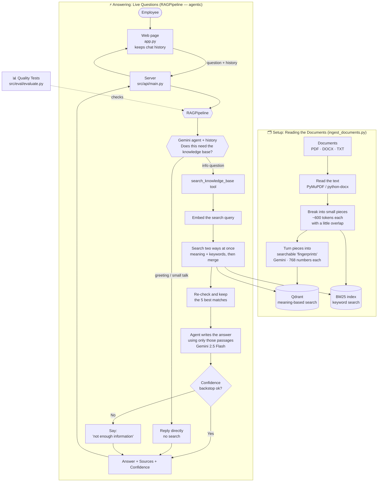

# AnthraSync — How the System Works

**A smart assistant that answers questions using your company's own documents.**

This is the **single, complete design document** for the project: what AnthraSync
is, how it's put together, the data flow, every component, the design decisions and
why, how it's evaluated, how it scales, and its limitations. For setup and run
instructions (local + Docker), see [README.md](README.md).

---

## 1. What It Does

AnthraSync lets employees ask everyday questions ("What's our refund policy?") and
get **clear answers based only on the company's own documents** — HR policies,
customer policies, technical guides, compliance rules, and FAQs.

It follows three simple rules:

1. **Stick to the facts** — answers come only from real company documents, not
   from the AI's imagination.
2. **Show its work** — every answer lists which documents it came from.
3. **Admit when it doesn't know** — if the answer isn't in the documents, it says
   so instead of making something up.

The system has **two parts**:

- A **setup part** that reads all the documents ahead of time and organizes them
  so they're easy to search.
- A **question-answering part** that handles questions live, one at a time.

---

## 2. The Big Picture



**Simple version of the answering steps (agentic):**

```
Question (+ chat history) ─▶ Gemini agent decides: do I need the knowledge base?
    ├─ No  (greeting / small talk) ─▶ reply directly, no search
    └─ Yes (information question)   ─▶ call the search tool:
            ─▶ Embed the search query
            ─▶ Search by meaning AND by keyword, then merge the results
            ─▶ Re-check and keep the 5 best matches
            ─▶ Agent writes an answer using only those passages
            ─▶ Confidence backstop ok?
                ├─ No  ─▶ "I don't have enough information…"
                └─ Yes ─▶ Answer + Sources + Confidence
```

The model itself chooses whether to search — so casual chat never touches the
database, and follow-up questions use the conversation history for context.

---

## 3. The Pieces and What They Do

| Piece | File | What it does |
|-----------|--------|----------------|
| **Document readers** | `src/ingest/loaders.py` | Pull the text (and page numbers) out of PDF, Word, and text files. |
| **Splitter** | `src/ingest/chunker.py` | Cut documents into small, bite-sized pieces (~600 tokens, counted with tiktoken) and label each with where it came from. |
| **Fingerprinter** | `src/ingest/embedder.py` | Turn each piece into a list of numbers that captures its meaning, so it can be searched. |
| **Organizer** | `src/ingest/indexer.py` | Store those pieces in two searchable indexes: **Qdrant** (meaning) and **BM25** (keywords). |
| **Searcher** | `src/retrieval/hybrid_search.py` | Search both indexes at once and combine the results into one ranked list. |
| **Re-checker** | `src/retrieval/reranker.py` | Take a closer look at the top matches and keep the 5 most relevant. |
| **Safety check** | `src/generation/guardrails.py` | Decide how confident the system is, and whether it should answer at all. |
| **Answer writer** | `src/generation/generator.py` | Write a clear answer using only the found documents, and refuse if they don't have the answer. |
| **Coordinator** | `src/pipeline.py` | Runs all the steps above in order. Used by both the server and the quality tests. |
| **Server** | `src/api/main.py` | The behind-the-scenes service that receives questions and sends back answers. |
| **Web page** | `app.py` | The simple page where employees type their questions. |
| **Quality tester** | `src/eval/evaluate.py` | Runs a set of test questions through the system and reports how well it did. |
| **Settings** | `src/config.py` | Holds all the settings (like keys and options), kept safely out of the code. |

---

## 4. Step by Step

### 4.1 Setup: Reading the Documents (done ahead of time)

Run it with: `python ingest_documents.py --data-dir data/sample_documents --recreate`

```
1. READ      Open each file and pull out the text, page by page.
             PDFs keep their real page numbers; text and Word files are split
             into logical "pages."

2. SPLIT     Break each page into small pieces (~600 tokens, counted with
             tiktoken), with a bit of overlap so nothing important gets cut in
             half. Each piece is labeled with its document, page, and position.

3. FINGERPRINT
             Turn each piece into a list of 768 numbers that captures its meaning.
             Documents and questions get different task-instruction prefixes, and
             each (truncated) vector is L2-normalized. Done in batches to stay
             within usage limits.

4. STORE     a) Save the meaning-fingerprints in Qdrant (for meaning-based search).
             b) Build a keyword index (BM25) and save it to disk
                (data/bm25_index.pkl, data/bm25_corpus.pkl).
```

For the sample set (5 documents, 17 pages), this creates **35 pieces**.

### 4.2 Answering: Each Question (live, agentic)

The model is given **one tool** (`search_knowledge_base`) and the conversation so
far, and it decides for itself whether the database is needed.

```
Message comes in (+ chat history): "What is the refund policy?"
    │
    ▼
1. THE AGENT DECIDES         Gemini reads the message + history and either:
                             ├─ greeting / small talk → reply directly (skip to 6)
                             └─ information question   → call search_knowledge_base
    │
    ▼  (only if it searched)
2. FINGERPRINT THE QUERY     The agent's search query is turned into a number-list.
    │
    ▼
3. SEARCH TWO WAYS           • By meaning (Qdrant)  • By keywords (BM25)
                             • Merge both result lists into one ranked list
    │
    ▼
4. RE-CHECK                  Closer look at the top matches; keep the 5 best ones.
    │
    ▼
5. WRITE THE ANSWER          The agent answers using ONLY those passages, and is
                             told to refuse if they don't contain the answer.
                             Retries automatically if the service is briefly busy.
    │
    ▼
   CONFIDENCE BACKSTOP       If the search was essentially empty/irrelevant
                             (top score below the floor), override with
                             "not enough information" instead.
    │
    ▼
6. SEND BACK                 The answer, the source documents, and a confidence
                             score. (Greetings come straight here with no sources.)
```

### 4.3 What an Answer Looks Like

```json
{
  "answer": "Refunds are allowed within 30 days of the original purchase date…",
  "sources": [
    { "document": "Customer_Policy.txt", "page": 5 }
  ],
  "confidence": 0.71,
  "context_used": [ /* the full document pieces used, so the UI can show them */ ]
}
```

The request field for the question is `question`, plus an optional `history`
array of prior turns (`{"role": "user"|"assistant", "content": "…"}`) that lets
the assistant follow up on earlier messages. `confidence` is a score from 0 to 1
showing how sure the system is (reported as 1.0 for a direct greeting, where no
search happened). When it can't answer, `answer` is the standard "not enough
information" message and `sources` is empty.

---

## 5. How It Avoids Making Things Up (safety nets)

The system measures how confident it is using the re-checker's own relevance
score for the best matching passage — a number from 0 to 1, where off-topic
questions score near 0 and clean factual hits score near 1. Two nets work
together: a deterministic confidence floor and a grounded prompt.

1. **Confidence floor:** the re-checker (`bge-reranker-base`) already gives each
   passage a 0–1 relevance probability. If the best passage scores below the
   floor (**0.10**), the search came back essentially empty/irrelevant and the
   system overrides the answer with the "not enough information" message — a
   deterministic guard against answering on near-random or out-of-scope queries.
2. **Strict instructions:** the agent is also told to answer **only** from the
   passages the search tool returned, and to reply with *exactly* "I don't have
   enough information in the knowledge base to answer that." whenever they don't
   actually contain the answer. This backs up the floor on the few tricky cases
   whose scores still overlap (a genuinely answerable edge-case can score just
   below an out-of-scope one).

Because the agent decides whether to search at all, casual chat (greetings,
thanks) is answered directly and never triggers either net. Together these refuse
genuinely unanswerable questions without wrongly refusing the tricky-but-valid
ones.

---

## 6. What We Used and Why

| Part | Choice | Why |
|-------|--------|-----|
| Language | Python 3.11+ | Best ecosystem for this kind of AI work. |
| AI model | Gemini 2.5 Flash | Fast, cheap, handles lots of text; easy to swap out. |
| Fingerprints | Gemini `embedding-2` (768 numbers, L2-normalized, task-instruction prefixes) | High-quality, made by the same provider. |
| Meaning search | Qdrant (Cloud) | Very fast search, saves to disk, managed option available. |
| Keyword search | BM25 (`rank-bm25`) | Catches exact words and acronyms that meaning-search can miss. |
| Combining results | Reciprocal Rank Fusion | A reliable way to merge the two search methods. |
| Re-checker | `bge-reranker-base` | Big accuracy boost for low cost; runs locally and free. |
| Server | FastAPI + Uvicorn | Fast, modern, with automatic documentation. |
| Web page | Streamlit | Quick and clean way to build the Q&A page. |
| Settings | pydantic-settings + `.env` | Type-checked, keeps secrets out of the code. |
| Packaging | Docker + docker-compose | Start the whole thing with one command. |

---

## 7. How It's Deployed

```
┌────────────────────────────────────────────────────────────┐
│  docker-compose                                             │
│                                                            │
│   ┌────────────┐    HTTP     ┌──────────────┐              │
│   │ Web page   │ ─────────▶  │  Server      │              │
│   │  (app.py)  │  question   │ (uvicorn)    │              │
│   │  :8501     │ ◀─────────  │  :8000       │              │
│   └────────────┘   answer    └──────┬───────┘              │
│                                     │                       │
│                              ┌──────▼───────┐               │
│                              │   Qdrant     │  (local or    │
│                              │   :6333      │   Qdrant Cloud)│
│                              └──────────────┘               │
│                              Keyword index = file on disk    │
└────────────────────────────────────────────────────────────┘
        │                                   │
        ▼                                   ▼
  Gemini service (fingerprints + answers, over the internet)
```

The re-checker (`bge-reranker-base`) runs **inside the server itself**
(downloaded once, then reused). Qdrant can either run alongside everything else
or live in the cloud (right now it's set to the cloud).

---

## 8. Will It Handle More Load?

**The server keeps no memory between questions.** Conversation memory is held by
the *client* and replayed with each request (the `history` field), so the server
itself stays stateless — you can still run several copies side by side to handle
more traffic. The heavy stuff (the re-checker model, the connections) is loaded
just once when it starts.

**The agent skips work it doesn't need.** Greetings and small talk are answered
directly without touching the database, so only genuine questions pay the cost of
search + re-ranking. The trade-off is that a real question now uses two model
calls (decide-and-search, then answer) instead of one.

**Setup and answering are separate.** Re-reading documents or adding new ones
never interrupts people asking questions. For very large document sets, the
slowest part is making the fingerprints — and that's already done in batches and
can be split up to go faster.

**Meaning search scales well.** Qdrant stays fast even with millions of pieces and
can be spread across multiple machines in the cloud. Its labels also leave room
for future features like per-department access.

**Keyword search.** BM25 currently lives in a single file in memory — fine for
thousands of pieces. At much bigger scale it would move into Qdrant or a dedicated
search engine.

**Re-checking.** It only looks at the top ~10 merged matches per question, so its
cost stays the same no matter how big the document set gets. It can move to faster
hardware if needed.

**AI speed and cost.** Writing answers is the main limit. To help, the system
keeps answers focused, limits how much text it sends, and retries automatically
when the service is briefly busy. The model is a setting, so upgrading to a faster
or paid tier is a one-line change.

---

## 9. Key Design Decisions (and why)

1. **Setup separated from answering** — ingestion (`ingest_documents.py`) and the
   live pipeline are independent, so re-reading documents never interrupts users
   and each can be scaled/tuned on its own.
2. **Token-based chunking (~600 tokens)** — length is measured in tokens (tiktoken
   `cl100k_base`), not characters, because the embedder has a *token* limit; tokens
   track it far better than characters, especially for dense content like tables.
3. **Hybrid search + RRF** — dense (meaning) and sparse BM25 (exact keywords/
   acronyms) cover each other's blind spots, merged by Reciprocal Rank Fusion so we
   never have to reconcile two incompatible score scales.
4. **Cross-encoder re-ranking** — the single biggest accuracy boost; it reads the
   question and a passage *together*, far more precise than the embedding match. It
   only runs on the ~10 merged candidates, so cost stays flat as the corpus grows.
5. **Embeddings: task prefixes + L2-normalization** — `gemini-embedding-2` ignores
   the old `task_type` field, so we steer it with instruction prefixes (`title:…|
   text:…` for documents, `task: question answering | query:…` for questions); and
   because 768 is a truncated (MRL) size, vectors are L2-normalized for correct
   cosine search.
6. **Agentic tool use over a fixed chain** — instead of always retrieving, the LLM
   gets a `search_knowledge_base` tool and decides whether it's needed. This makes
   greetings/small talk work (no pointless search, no false refusal), lets the model
   rewrite the search query, and turns the confidence floor into a backstop. Built
   on native `google-genai` function calling (no LangChain) — one tool, lightweight
   app, full control. Trade-off: ~2 model calls per factual question.
7. **Two anti-hallucination nets** — a confidence floor (abstain when the top
   reranker probability is below **0.10**) plus a strict grounded prompt (answer
   only from the passages, else a fixed refusal). The reranker score is already a
   0–1 probability, so it's used directly — an earlier bug double-applied a
   sigmoid and crushed every score into [0.50, 0.73], which is why the floor used
   to be set at 0.50 and looked ineffective. With that fixed, the floor cleanly
   catches out-of-scope queries; the prompt covers the few cases whose scores
   still overlap, hence two nets.
8. **Conversation memory, kept stateless** — follow-ups work by having the *client*
   replay recent turns; the server stores nothing, preserving horizontal scaling.

---

## 10. Evaluation

A self-contained harness (`src/eval/evaluate.py`) runs a hand-written test set
(`data/test_queries.json` — 15 questions across 5 categories: direct factual,
cross-document, ambiguous, out-of-scope, edge case) through the **exact production
pipeline**, so results reflect what real users get.

**Run it:**
```
python -m src.eval.evaluate            # deterministic metrics (fits free tier)
python -m src.eval.evaluate --judge    # + Gemini faithfulness score (more calls)
```

**Metrics:**
- **source_accuracy** — was the right document cited? (pure retrieval quality)
- **keyword_recall** — fraction of expected phrases present in the answer
- **abstention_accuracy** — did it correctly refuse out-of-scope/empty questions?
  (credited if *either* net fires: the confidence floor or the grounded refusal)
- **avg_latency_ms**, **avg_confidence** — speed and confidence
- **faithfulness** (optional `--judge`) — a RAGAS-style groundedness check: Gemini
  rates whether every claim is backed by the retrieved context (best-effort)

Output goes to the console, `eval_report.md` (readable tables), and
`data/eval_results.json` (full detail). Typical runs show **source accuracy = 1.0**
and high keyword recall on factual questions; a clean full run is limited mainly by
the Gemini free-tier daily quota.

---

## 11. Current Limits

- **Free AI quota** (~20 answers a day) slows down bulk testing and demos; a paid
  tier removes this.
- **Memory is per-session and client-held** — follow-ups work within a chat
  session (the client replays recent turns), but history isn't stored server-side
  and is capped to the most recent turns, so very long conversations forget the
  earliest messages.
- **Approximate page numbers for text files** — plain-text files are split into
  logical "pages," so their page numbers are rough (PDF page numbers are exact).
- **Keyword index is in memory** — see the scaling note above.
- **No authentication** — the API is open; add a key/login layer before exposing it.

## 12. What Could Come Next

Server-side / persistent conversation memory (beyond the current client-held
history) · using the collected 👍/👎 feedback to tune retrieval/prompts · adding
more agent tools (e.g. separate HR vs. compliance indexes, a calculator) · moving
keyword search into Qdrant · logins and per-document access control · bigger,
enterprise-grade hosting.
